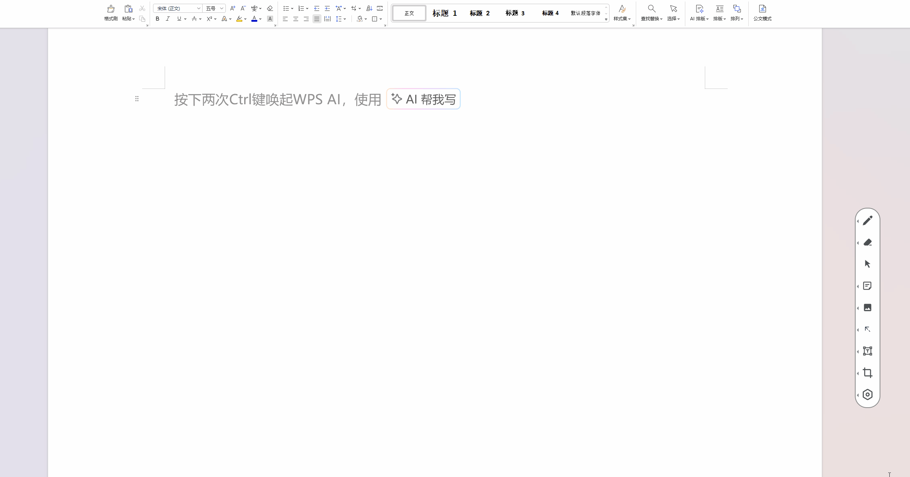

经过了 9 个月断断续续的开发，终于写完了第一个正式版本 V1.0.0，尽管这个版本仍然有一些bug和一些性能问题，但是总算是坚持，一点一点写完了我规划的功能。还是挺高兴的。

After 9 months of intermittent development, I finally finished the first official version V1.0.0. Although this version still has some bugs and performance issues, I finally persisted and completed the functions I planned bit by bit. I am still very happy.

Adam 是一款 Windows 端窗口绘图软件，它能在窗口上绘制手写笔，箭头，矩形，橡皮效果，镭射笔效果，并且通过安装 chrome 浏览器插件 adamExtension，Chrome 网页中绘制的元素可以跟随网页元素移动、滚动。对于非 Chrome 口，绘制的元素也是可以跟随窗口移动的，绘制图形的背景也可以是动态的视频\[需要关闭Chrome的窗口遮蔽优化，[link](/blog/2025/2025-01-17-让背景视频播放)\]。每个窗口 / Chrome tab 均是一个独立的画布。

Adam is a Windows window drawing software that can draw stylus, arrows, rectangles, eraser effects, laser pen effects on the window, and by installing the Chrome browser plug-in adamExtension, the elements drawn in the Chrome webpage can move and scroll with the webpage elements. For non-Chrome ports, the drawn elements can also move with the window, and the background of the drawn graphics can also be a dynamic video \[need to turn off Chrome's window masking optimization, link\]. Each window/Chrome tab is an independent canvas.

当然，Adam 的定位是工具类软件，它也提供了截图，图像缩放常见的功能。

Of course, Adam is positioned as a tool software, and it also provides common functions such as screenshots and image zooming.

1. **设计图** Design drawing

2\. **功能演示** Functional Demonstration

**3\. 后续计划** Next steps

后续 adam 不仅需要继续修 bug，支持 Mac机器，支持Edge浏览器、FireFox浏览器。

In the future, Adam not only needs to continue fixing bugs, but also support Mac machines, Edge browsers, and FireFox browsers.

还要添加 3D 功能，我对 Adam 的 3D 功能的期待是它能够在绘制二维的线稿过程中，自动推理/匹配出对应的三维空间结构，拥有一定的建模能力。

We also need to add 3D functions. My expectation for Adam's 3D function is that it can automatically infer/match the corresponding three-dimensional spatial structure while drawing two-dimensional line drafts, and has certain modeling capabilities.

**4\. 结尾** Finally

安装步骤见 [link](/blog/2025/2025-01-17-adam安装步骤)，用户手册见 [link](/blog/2025/2025-01-17-adam-v1-0-0-用户手册)。期待你的使用和反馈。希望有人会喜欢它！

Installation steps can be found at this [link](/blog/2025/2025-01-17-adam安装步骤), and the user manual can be found at this [link](/blog/2025/2025-01-17-adam-v1-0-0-用户手册). Looking forward to your use and feedback. Hope someone will like it!
